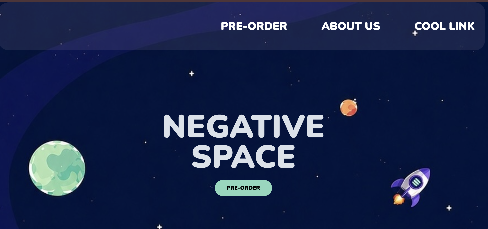

[](https://classroom.github.com/a/j3SJFt0N)

# Negative Space 🚀

## Repo 🔗

[GitHub](https://github.com/Medieinstitutet/fed25d-grafiska-verktyg-negative-space)

## Screenshots 📸

### Desktop


### Tablet


### Mobil


## Om designen

I detta projekt har vi designat en onepager för spelet Negative Space, där vi har fokuserat på att skapa en tydlig, visuellt tilltalande och tematiskt sammanhängande upplevelse. Spelets namn har varit en viktig utgångspunkt i designen, där vi har arbetat med kontraster, luft och ytor för att förstärka känslan av “negative space”. Genom att använda tomrum och balans i layouten har vi skapat en design som känns luftig och lätt att navigera. Färgpaletten är en viktig del av designen. Vi har valt en mörkblå bakgrund för att representera rymden och skapa en känsla av djup. Den mörka bakgrunden gör också att andra element framträder tydligare. Till detta har vi lagt till ljusare accentfärger som mintgrön, lila, rosa och gul. Dessa färger används främst på interaktiva element som knappar, samt på karaktärerna, för att skapa kontrast och guida användarens blick genom sidan. Kombinationen av mörkt och ljust hjälper till att skapa balans och förstärker känslan av rymd och utforskning. Typografin är vald för att vara enkel och lättläst. Vi har arbetat med en tydlig hierarki där rubriker är större och mer framträdande, medan brödtexten är mindre och mer neutral. Detta gör att användaren snabbt kan förstå strukturen och vad som är viktigast på sidan. Vi har också hållit oss till ett begränsat antal typsnitt för att skapa en enhetlig och ren design. Knapparna har rundade hörn, vilket följer det mjuka formspråket i illustrationerna och resten av designen. Vi har använt olika färger på knapparna för att skapa variation och göra dem tydliga mot den mörka bakgrunden. Färgerna är hämtade från samma palett som övriga element, vilket gör att knapparna känns som en naturlig del av helheten. Det hjälper också användaren att snabbt uppfatta vilka delar på sidan som går att interagera med. Menyn är enkel och diskret placerad högst upp på sidan. Den är utformad för att vara lätt att förstå utan att ta upp för mycket visuell plats. Eftersom det är en onepager har vi valt att hålla navigationen minimal. Vi har även inkluderat ett kortelement i form av en popup som visas när användaren klickar på “Preorder”. Detta innehåller inputfält för namn och e-post samt knappar för att acceptera eller avbryta. Genom att visa detta element först vid interaktion kan vi hålla layouten ren samtidigt som vi uppfyller kraven på funktionella komponenter. Illustrationerna spelar en central roll i designen. Karaktärerna ger sidan personlighet och förstärker berättelsen. Vi har även använt former och ytor för att skapa tydliga kontraster mellan innehåll och bakgrund, vilket gör designen mer lättnavigerad. Sammanfattningsvis har vi strävat efter en design som är tydlig, sammanhängande och engagerande, där alla val stödjer både temat och användarupplevelsen.

[Design](https://www.figma.com/design/kNFnuK1cUeGFNAHNQAOXo4/Negative-Space?node-id=1-233&p=f&t=dTBdnw6UDA4NA8Di-0)


## Om projektet 🪐

Negative Space är ett spel om överlevnad — Mars resurser sinar och fyra astronautträningar skickas ut på ett livsavgörande uppdrag för att hitta en ny planet åt mänskligheten. Uppdraget kallas Expedition Positive Space.
Vi är en grupp på fyra studenter som fick designen för spelets lanseringssida tilldelad av en annan grupp. Vårt jobb var att bygga sidan i kod — från HTML och SCSS till ett fungerande resultat.

## Tekniker 🛠️

Sidan är byggd med HTML för struktur, SCSS för styling där vi jobbat med grid och flexbox för att få till en responsiv layout, samt lite JavaScript för interaktivitet. Som byggverktyg har vi använt Vite.


## Kör projektet 💻

```
npm install
npm run dev
```


## Gruppmedlemmar

- Oscar Holmblad

- Lina Svärd

- Sandra Hellström

- Ika Ossler

- Helena Gustafsson


